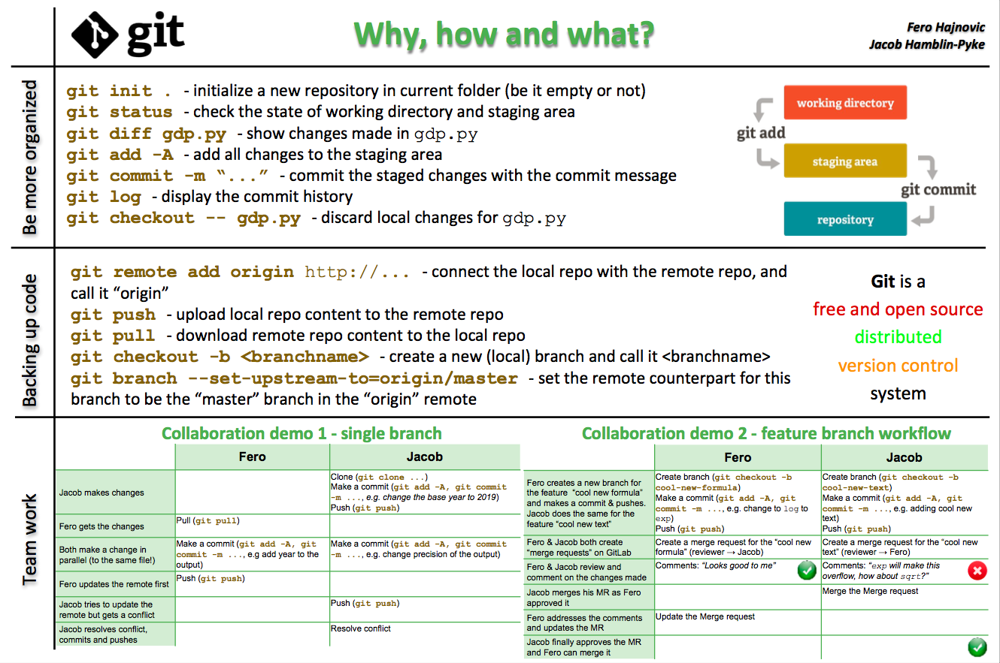

# The principles and practice of Git

Fero Hajnovic and Jacob Hamblin-pyke took us through understanding the main concepts of git, with a demo of using it in a team environment.

Check out their slides, the last slide gives an overview of what they got up to and an example of the live demo:

