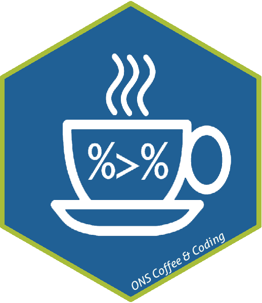

# ONS Newport Coffee & Coding

A _public_ repository to hold resources and notes from ONS Coffee & Coding sessions. GitHub repository idea and layout lovingly sourced from [Department for Transport (DfT)'s repo](https://github.com/departmentfortransport/coffee-and-coding). Interested in what other Government Departments have coffee and coding? Check out the [Government RAP website](https://ukgovdatascience.github.io/rap-website/resource-coffee-and-coding.html).

Get in touch at: coffee.coding@ons.gov.uk, we welcome suggestions and ideas for future events.

### Contributing 
Note that resources are _publicly accessible_. When adding new content work on a branch and submit a pull request. 

Folders should adhere to the following conventions:

* `YYYYMMDD_Topic_Name`
* All folders should contain a `README.md` with notes or a brief explanation

### Aim
The aim of the Coffee & Coding meetups is to nurture, enable and encourage a vibrant, supportive and inclusive coding community at ONS. Coffee & Coding provides a regular opportunity for people within ONS who are interested in coding to share skills and knowledge, provide advice and guidance to each other and generally network and get to know each other. The format is generally 40 minutes for a presentation and questions to the presenter/s followed by an informal Code Surgery. The presentations usually take the form of a demonstration of a tool or technique and/or a show and tell of work done within the department using these methods. From time to time we will invite external speakers. The Code Surgery provides the opportunity for people to pose any coding related queries/ruminations/ideas to the gathered coding community.

### Coffee & Coding Schedule

Please note *events are restricted to ONS employees*, unless individual approval has been given. Please note that currently events are going to be held in ONS Newport without skyping to Titchfield and London, if you have any comments please get in touch. Register for the next event (22nd July) via eventbrite [here](https://www.eventbrite.co.uk/e/coffee-and-coding-reproducible-analytical-pipelines-rap-tickets-63103007795).

|Date| Time | Room | Title | Presenter | Abstract|
|:--------------|:----|:---|:---------|:--------------------|:-------------------------------|
|Tue 11 June 2019 | 14:30 - 15:30 | NPT R.103 | Best Practice == Clean Code | Skevi Pericelous | 9 elements of clean code for best practice, and examples of good/bad practice with discussions for causes, and how code can be improved.
|Tue 14 May 2019 | 11:00 - 12:00 | NPT R.103 | Show-and-Tell Carousel | Ryan Schofield, Vinny Anand-Kumar, Lewis Edwards | multiple ONS colleagues presenting examples of coding software they've used (R and Python) in their work, and how to get started doing the same
|Tue 16 Apr 2019 | 10:30 - 11:30 | NPT D.289 | Building Skills for DAP | Isabela Breton | What the Data Science Campus is doing as a partner to build skills for DAP
|Thur 14 Mar 2019 | 10:00 - 11:00 | NPT D.289 | Be More Functional | Gareth Clews | Gareth live coding in python to give attendants a new view on how to formulate and solve problems.
|Tue 19 Feb 2019 | 10:00 - 11:00 | NPT D.289 | Problem Solving with LEGO | Ian Grimstead | Interactive session (involving LEGO!) thinking about good practices involve in solving problems with code.
|Tue 15 Jan 2019 | 10:00 - 11:00 | NPT D.289 | "What is Coffee and Coding?", Lightning Talk: two mentoring programs | Rose Almond & Skevi Pericelous | What Coffee and Coding is, a description of Data Science mentoring programs and how to apply, and then a Code Surgery (with R standards game)
|Tue 27 Nov 2018 | 10:00 - 12:00 | NPT R103 | "What is Coffee and Coding?" and "An Introduction to Data Science Tools" | Luke Shaw & David Pugh | What Coffee and Coding is across government and the plan for ONS, and an introduction to some of the various tools used in Data Science and when to use them - with a focus on R and Python.

